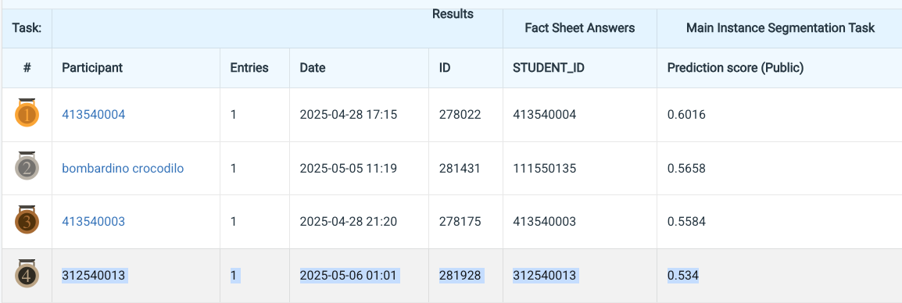

# Homework 3: Instance Segmentation

**StudentID**: 312540013  
**Name**: Do Tran Nhat Tuong

---

## Introduction

This project tackles the problem of instance segmentation in histological microscopy images using the Mask R-CNN framework. Unlike semantic segmentation, instance segmentation distinguishes individual object instances even within the same category. This task becomes particularly challenging in medical imaging, where numerous small, densely packed nuclei must be segmented, often with severe overlaps and occlusions.

My work leverages Mask R-CNN with architectural improvements (e.g., MPViT backbone) to enhance segmentation accuracy. I address practical challenges such as small object size, class imbalance, and instance crowding. Extensive visualizations reveal the difficulty of this dataset: highly variable object shapes, tightly clustered regions, and dominant class imbalance all affect model performance. I aim to build a robust instance segmentation pipeline suitable for these demanding scenarios, following recent research advancements in medical vision models.


---

## How to install

Install the environment using the following steps:

```bash
# Create and activate conda environment
conda create -n hw3-env python=3.8
conda activate hw3-env

# Install PyTorch with CUDA 12.1 support
conda install pytorch==2.1.2 torchvision==0.16.2 torchaudio==2.1.2 pytorch-cuda=12.1 -c pytorch -c nvidia

# Install Detectron2
python -m pip install 'git+https://github.com/facebookresearch/detectron2.git'

# Install OpenCV
pip install opencv-python

# Install `shapely`
conda install shapely
```

## 📁 Project Structure

```bash
# folder structure
HW2/
│
├── data/                 # COCO-format dataset folders: train, test_release, test, train.json, val.json, full.json, test_image_name_to_ids.json
├── visualize/            # Visualization scripts for plots and analysis
└── README.md             # This file
```

## Dataset Preparation
```bash
# Make COCO-format annotations
python create_coco_labels.py
```

---

## Training
```bash
# MPViT
python train_net.py --config-file configs/maskrcnn/mask_rcnn_mpvit_base_ms_3x.yaml --num-gpus 8
# ResNet
python train_resnet.py --model mask_rcnn_X_101_32x8d_FPN_3x.yaml --output_dir checkpoints/models/X101_FPN3x
```

## Testing
```bash
# MPViT
python test.py --output_dir results/mask_rcnn_mpvit_base_ms_3x --trained_model output/mask_rcnn_mpvit_base_ms_3x
# ResNet
python test_resnet --output_dir results/models/X101_FPN3x --trained_model ./checkpoints/models/X101_FPN3x
```

## Performance snapshot
- Segmentation mAP: **0.534**
- Leaderboard ranking: **Top 4**

<p align="center">
  
</p>

---

## References

[1] Kaiming He, Georgia Gkioxari, Piotr Dollár, and Ross Girshick.  
**Mask R-CNN**. *Proceedings of the IEEE International Conference on Computer Vision (ICCV)*, 2017.  
[https://arxiv.org/abs/1703.06870](https://arxiv.org/abs/1703.06870)

[2] Youngwan Lee, Yuenan Chen, Yu-Ying Lin, and Yu-Chiang Frank Wang.  
**MPViT: Multi-Path Vision Transformer for Dense Prediction**.  
*CVPR 2022*. [https://arxiv.org/abs/2112.11010](https://arxiv.org/abs/2112.11010)

---

## Codebase Acknowledgment

This project is built upon the official MPViT Detectron2 implementation:  
[https://github.com/youngwanLEE/MPViT/tree/main/detectron2](https://github.com/youngwanLEE/MPViT/tree/main/detectron2)

