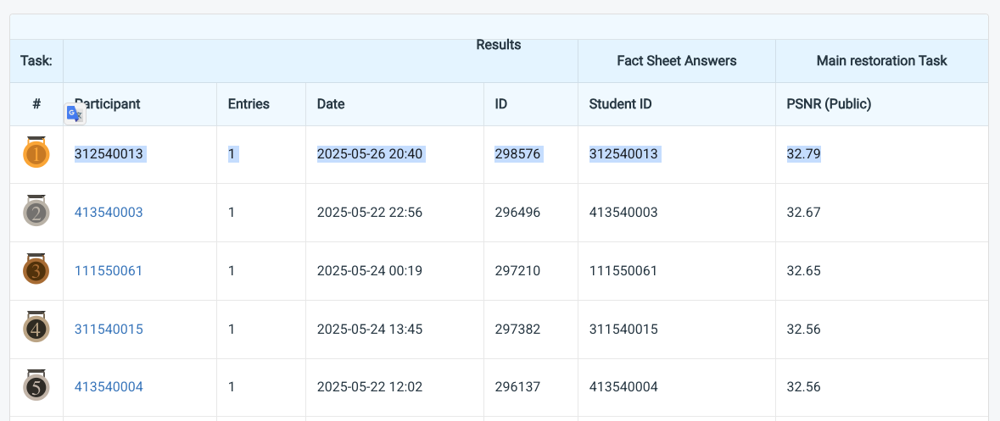

# Homework 3: Image Restoration

**StudentID**: 312540013  
**Name**: Do Tran Nhat Tuong

---

## 📝 Introduction

This project implements **PromptIR** [PromptIR](https://arxiv.org/abs/2306.13090), an all-in-one blind image restoration model, and extends it with an **edge-aware loss** to improve perceptual quality. The model is trained to simultaneously restore images degraded by **rain** and **snow**, using a unified network and prompt-based guidance. Additionally, I perform a thorough ablation on the number of augmentations per sample and show how it affects generalization.

Key contributions:
- Joint deraining and desnowing using PromptIR.
- Integration of edge loss to preserve structural details.
- Ablation on number of augmented samples (0, 25, 120) showing the effect on PSNR.

---

## ⚙️ How to install

```bash
# (Recommended) Create conda environment
conda env create -f environment.yml
```

## 📁 Project Structure

```bash
# folder structure
HW4/
├── data/                   # COCO-format dataset: hw4_realse_dataset/, rain.txt, snow.txt, preprocess.py
├── train.py                # Main training script
├── demo.py                 # Inference script
├── utils/                  # Supporting modules (loss, scheduler, dataset utils, etc.)
├── net/                    # PromptIR model implementation
├── output/                 # Saved predictions
└── README.md               # This file
```

## 📦 Data Preparation
```bash
# Generate text files listing rain/snow images
python data/preprocess.py
```

## 🚀 Training
```bash
CUDA_VISIBLE_DEVICES=0,1,2,3 python train.py
```

## 🔍 Inference
```bash
# Save predictions to output folder
python demo.py --output_path output/rainsnow_edge --ckpt_name ./train_ckpt/best_rainsnow_edge.ckpt

# Convert results to .npz submission format
python data/example_img2npz.py
```

## 📈 Performance Snapshot
- PSNR: **32.79**
- Leaderboard ranking: **Top 1**

<p align="center">
  
</p>

---

## References
[1] Vaishnav Potlapalli, Syed Waqas Zamir, Salman Khan, and Fahad Shahbaz Khan.
PromptIR: Prompting for All-in-One Blind Image Restoration.
arXiv preprint arXiv:2306.13090, 2023.
[https://arxiv.org/abs/2306.13090](https://arxiv.org/abs/2306.13090)

---