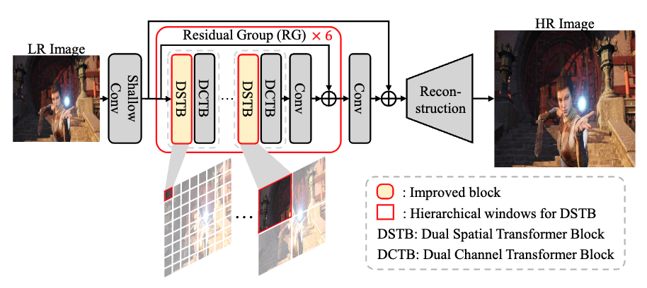
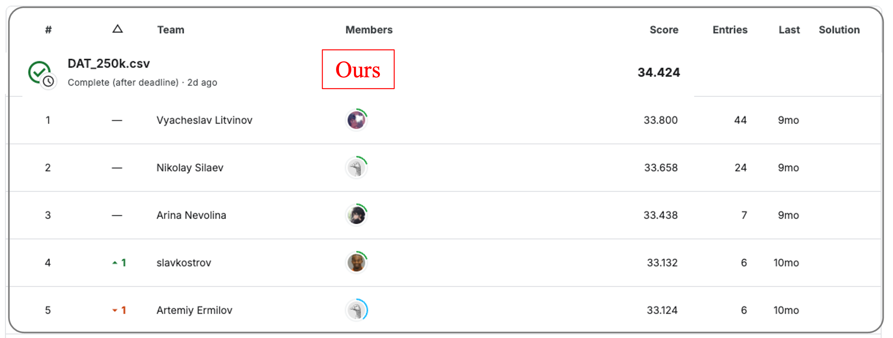

# Super Resolution in Video Games

## Member:
1. Do Tran Nhat Tuong (Student ID: 312540013)
2. Le Ngoc Hoang Lam (Student ID: 312540020)
3. Do Huu Phu (Student ID: 311540015)

---

## 📖 Introduction

Image Super-Resolution (SR) reconstructs a high-resolution (HR) image from a low-resolution (LR) input. In the “Super Resolution in Video Games” challenge, the task is to upscale game screenshots by \(4x\), converting \(64x64\) LR tiles into \(256x256\) HR outputs while retaining sharp edges and fine details. The training set includes paired LR-HR images at \(270x480\) (LR) and \(1080x1920\) (HR). At inference time, LR patches are cropped to \(64x64\) and corresponding HR targets are \(256x256\). PSNR is used for evaluation, and we match test-time conditions by randomly cropping \(64x64\) LR and \(256x256\) HR patches during training.

**Key Contributions**  
1. **Multi-Scale Window DAT (MSW-DAT)**  
   - Introduce a hierarchical multi-scale window mechanism that increases attention window size across Transformer layers.  
   - Improves receptive field, capturing both small UI elements and large background textures.

2. **Patch Cropping Consistency**  
   - Apply random paired cropping of LR (64x64) and HR (256x256) patches during training.  
   - Ensures alignment between training and inference spatial contexts.

3. **State-of-the-Art Results**  
   - Achieve a PSNR of 34.315 on the test leaderboard, surpassing the previous top solution (PSNR 33.800).  
   - Demonstrate that MSW-DAT balances local detail recovery and global structure in video game imagery.

<p align="center">
  
</p>
<p align="center"><strong>Figure 1:</strong> MSW-DAT architecture.</p>

---

## How to install
```bash
conda env create -f environment.yml
conda activate final
```

## 📂 Project Structure
```bash
final_proj/
├── datasets/
│   ├── train/                 # Low-res and high-res training pairs
│   ├── val/                   # Validation set (paired LR-HR)
│   └── process.py          # Script to crop/prepare LR/HR patches
│
├── videogames_data/
│   ├── train/                 # Full Low-res and high-res training pairs
│   ├── test/                  # Test LR set 
│
├── experiments/
│   └── DAT_x4.pth     # Downloaded pretrained .pth files
│
├── scripts/
│   ├── train.sh               # Single-line training command
│   ├── test.sh                # Single-line inference command
│
├── figures/
│   └── performance.png        # Snapshot of PSNR performance
│   └── architecture.pdf       # Model architecture diagram
│
├── environment.yml            # Conda environment definition
│
├── gen.py           
```

## Download Dataset
Download at [Video Games](https://www.kaggle.com/competitions/super-resolution-in-video-games/data).

## 🔧 Data Preparation
Generate random 64×64 LR patches and corresponding 256×256 HR patches:
```bash
python datasets/process.py
```
This script:
1. Reads paired LR-HR images from videogames_data/train.
2. Extracts a random 64×64 patch from the LR image.
3. Extracts the matching 256×256 patch from the HR image.
4. Saves preprocessed patches to datasets/train/ and datasets/val/.

## 📥 Download Pretrained Model
Download the official [DAT pretrained weights](https://drive.google.com/file/d/1pEhXmg--IWHaZOwHUFdh7TEJqt2qeuYg/view) and place them in experiments/:

## 🚀 Training
```bash
sh scripts/train.sh
```

Default configuration (in train.sh):
1. Batch size: 4 per GPU
2. Num of GPUs: 4
3. Checkpoints saved to checkpoints/train_DAT_scale_x4

## 🧪 Inference
```bash
sh scripts/test.sh
```
This script will:
1. Load experiments/train_DAT_scale_x4/models/net_g_100000.pth.
2. Read each 64×64 LR tile from datasets/test/.
3. Upscale to 256×256 using the trained model.
4. Save output images to results/DAT_scale_100k.csv for submission.


## 📊 Performance Snapshot
<p align="center">  </p> <p align="center"><strong>Figure 2:</strong> PSNR performance comparison on the Kaggle test leaderboard.</p>

## 📚 References
```bash
@inproceedings{chen2023dual,
    title={Dual Aggregation Transformer for Image Super-Resolution},
    author={Chen, Zheng and Zhang, Yulun and Gu, Jinjin and Kong, Linghe and Yang, Xiaokang and Yu, Fisher},
    booktitle={ICCV},
    year={2023}
}
```
